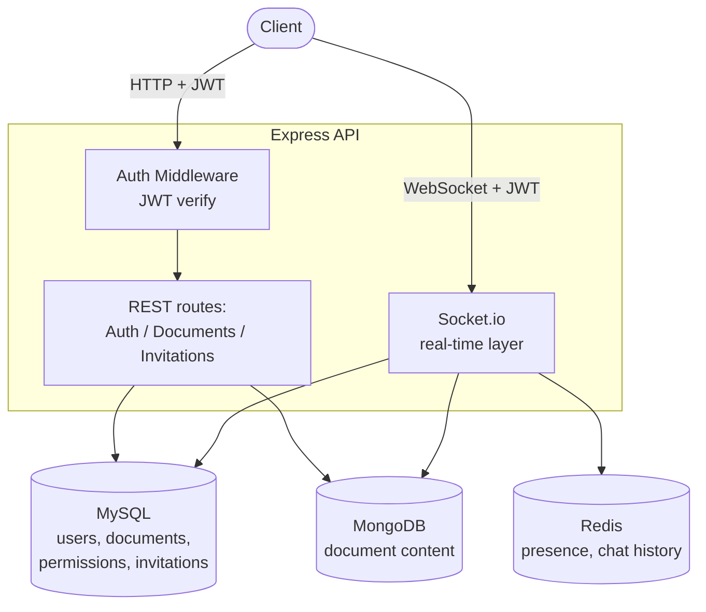
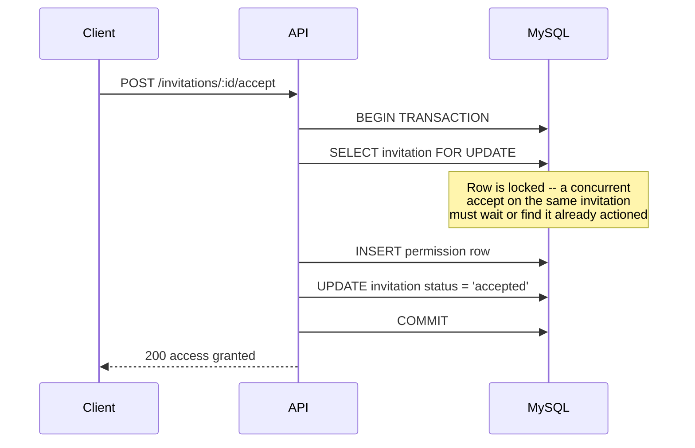

# Realtime Collab

A backend for a real-time collaborative document editor — think a stripped-down Google Docs backend. Built solo to demonstrate real-time systems engineering: WebSocket-based collaboration, a hybrid SQL/NoSQL/cache data architecture, transactional invitation handling, and role-based access control.

**Note on deployment:** this project is intentionally **not deployed** — it runs entirely via Docker Compose. Given the real engineering weight of this project is in its architecture and concurrency handling (not "is there a clickable URL"), and given the added complexity of wiring three separate free-tier database providers, running it locally via `docker compose up` was the better trade-off. See [Running locally](#running-locally) below — the whole stack (app + MySQL + MongoDB + Redis) comes up with one command.

[](https://github.com/neterosaan/Realtime-Collab/actions/workflows/tests.yml)

---

## What this project demonstrates

- **A deliberate hybrid-persistence architecture** — MySQL for relational integrity (users, documents, permissions, invitations — anywhere foreign keys and transactions matter), MongoDB for the actual document content (flexible, schema-less by design), and Redis for genuinely ephemeral, high-frequency state (live presence, recent chat history) that would be wasteful to put in a relational database.
- **Transaction-safe invitation acceptance** — accepting an invitation locks the invitation row (`SELECT ... FOR UPDATE`) inside a transaction, so two concurrent accept requests on the same invitation can never both succeed. Verified with a real concurrency test that fires both requests simultaneously against a real MySQL database and asserts exactly one wins.
- **Real-time collaboration over Socket.io** — authenticated socket connections, role-aware broadcasting (a `viewer` cannot broadcast edits; the server silently drops their attempt), live presence tracking, and persistent chat history — all tested with real socket client connections against a real running server, not mocked.
- **A genuine automated test suite**, including tests that exercise actual concurrent socket connections and prove negative cases (that an event *never* arrives), not just happy-path coverage.

---

## Architecture



### The invitation acceptance transaction



---

## Tech stack

- **Runtime:** Node.js 22, Express 4
- **Databases:** MySQL (relational data), MongoDB via Mongoose (document content), Redis (presence/chat)
- **Real-time:** Socket.io, with JWT-authenticated connections
- **Auth:** Self-issued JWTs (access + httpOnly refresh token cookie), bcrypt password hashing
- **Testing:** Vitest, with real disposable MySQL/MongoDB/Redis containers for integration tests, and real `socket.io-client` connections for real-time tests
- **CI:** GitHub Actions — runs the full suite, including real-time/socket tests, against real database service containers on every push
- **Containerization:** Docker Compose (app + all three databases)

---

## Features

| Feature | Notes |
|---|---|
| Auth | Register/login/refresh, JWT access tokens + httpOnly refresh cookie |
| Documents | Create, rename, delete (owner-only), list |
| Sharing | Invite-by-email (always grants editor role), accept/decline, race-safe acceptance |
| Public documents | Owner can mark a document public; any authenticated user can self-grant viewer access |
| Permissions | View/remove collaborators (owner-only) |
| Real-time editing | Broadcast content changes to everyone in a document's room except the sender |
| Presence | Live "who's online" list per document, updated on join/disconnect |
| Chat | Per-document chat with persisted history (last 100 messages, Redis-backed) |

---

## API reference

- **REST collection** (Auth, Documents, Invitations): [`realtime-collab.postman_collection.json`](./realtime-collab.postman_collection.json)
- **Interactive API docs (Swagger UI):** `http://localhost:4000/api-docs` once running locally.

### Testing the Socket.io layer manually

Postman's WebSocket/Socket.io requests currently **cannot be exported as a collection file** (a known, long-standing Postman limitation, not specific to this project), so instead of a file to import, here's how to set it up yourself in under a minute:

1. **New → WebSocket Request → connection type: Socket.IO**
2. URL: `http://localhost:4000` (not under `/api` — Socket.io's handshake happens at the server root)
3. **Headers tab:** `Authorization: Bearer <your access token>`
4. Click **Connect**
5. Emit `joinDocument` with a real document ID as the payload
6. Once connected, change the emit event field to test anything else on the same connection — `sendChanges` (broadcasts to everyone else in the document except you), or `sendChatMessage` (broadcasts to everyone *including* you)
7. Open a **second** WebSocket request the same way, joined to the same document ID, to see the broadcasts actually arrive on a different client

---

## Running locally

**Requirements:** Docker and Docker Compose.

```bash
git clone https://github.com/Ahmed-Amer02/Realtime-Collab.git
cd Realtime-Collab
```

Create a `.env` file at the project root:
```
NODE_ENV=development
PORT=4000

MYSQL_HOST=mysql-db
MYSQL_ROOT_PASSWORD=choose_a_password
MYSQL_DATABASE=collab_platform

MONGO_HOST=mongo-db
MONGO_PORT=27017
MONGO_USER=choose_a_user
MONGO_PASSWORD=choose_a_password
MONGO_DATABASE=collab_platform

REDIS_HOST=redis
REDIS_PORT=6379

JWT_SECRET=generate_a_long_random_string
JWT_EXPIRES_IN=15m
REFRESH_TOKEN_EXPIRES_IN_DAYS=30
```

```bash
docker compose up -d
```

Apply the schema to the fresh MySQL container (first run only):
```bash
docker exec -i <mysql-container-name> mysql -uroot -p<your_password> collab_platform < server/db/schema.sql
```

The API is now available at `http://localhost:4000`, with interactive docs at `http://localhost:4000/api-docs`.

### Running the tests

```bash
cd server
npm run test:db:up       # starts disposable test containers for MySQL/MongoDB/Redis
npm run test:db:migrate  # applies the schema to the test MySQL container
npm test
```

---

## Notable bugs found & fixed during development

- **A missing `port` option in the MySQL connection pool** meant it silently always connected on MySQL's default port (3306) — invisible inside Docker Compose (where container-to-container traffic uses the real internal port regardless), but broke immediately the first time anything (the test suite) connected from outside Docker to the host-mapped port.
- **Three separate unguarded `process.exit(1)` calls** (in the MySQL, Redis, and MongoDB connection modules) — reasonable for real production use, but each one would silently kill the *entire test process* on a connection failure rather than just that one attempt, turning a single bad connection into a cascade of unrelated-looking test failures.
- **A missing `AppError` import** in the invitation controller meant declining an already-actioned or nonexistent invitation threw a raw `ReferenceError` instead of a clean `404`.
- **A stale comment describing an already-fixed bug** was left in place after the underlying bug was corrected — actively misleading to a future reader, since the code was actually right and the comment claimed otherwise.
- **Dead, unwired role-restriction middleware** (`restrictTo`) existed but was never applied to any route, and referenced a URL parameter name (`documentId`) that doesn't match any actual route (`:id`) — removed rather than left as a trap for a future "just wire this in" assumption.
- **A test-writing mistake, not an app bug:** an early real-time test registered a `disconnect` event listener *after* awaiting a prior event, missing the disconnect because the server fires both events back-to-back — fixed by registering all listeners before triggering the action that causes them, a general rule for testing any event-driven system.

---

## Known limitations

- Real-time collaboration broadcasts raw `delta` payloads without interpreting them — the server relays them opaquely, meaning actual conflict-free merging (CRDT/OT) would need to happen client-side with a real rich-text editor library. This project provides the transport and access-control layer, not a text-editing algorithm.
- No horizontal scaling support for the Socket.io layer (would need a Redis adapter for `socket.io` to broadcast correctly across multiple server instances) — not needed at the current single-instance, local-only scale.
